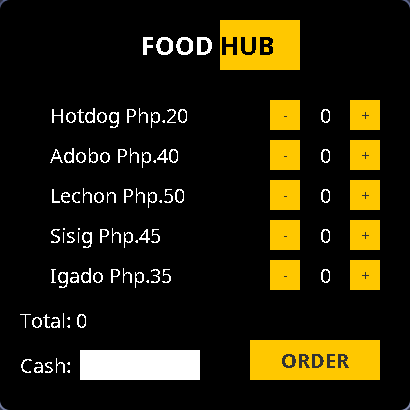

# Java GUI Activity

Welcome to the Java GUI Activity repository! This repository contains various Java GUI projects.
 
<i>- [rhazeDev](https://github.com/rhazeDev)</i>

## Projects

- [FoodHub](#foodhub)

## Projects

### FoodHub

FoodHub is a simple Java GUI-based food ordering system designed using Swing and AWT. It allows users to select food items, adjust quantities, calculate the total amount, and generate a receipt. The system also includes a basic cash input feature to compute change and validate transactions.